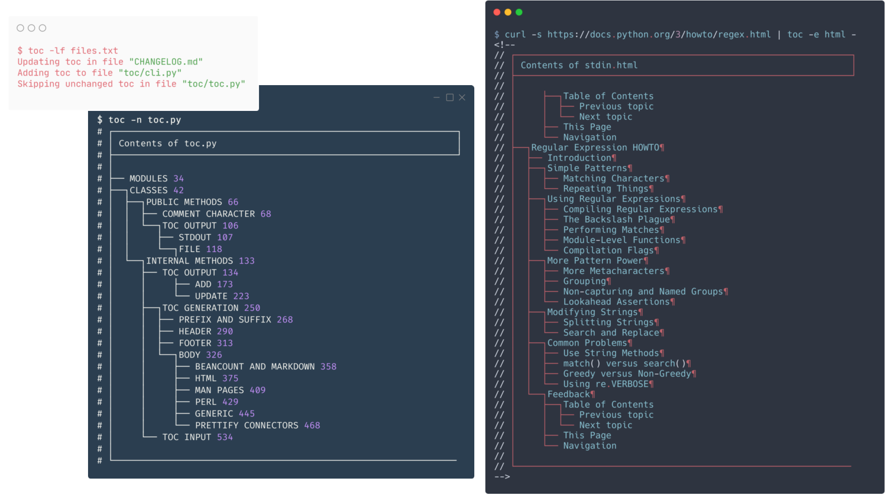
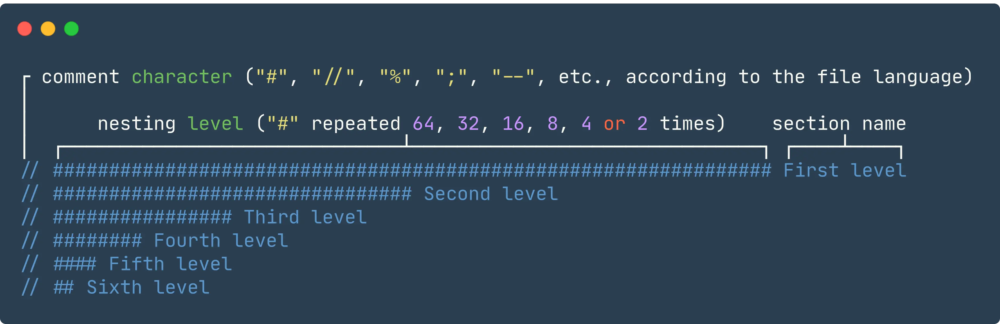
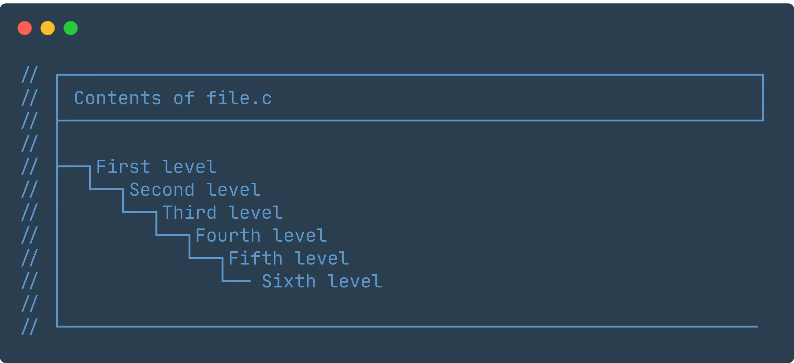

<!--
// ┌───────────────────────────────────────────────────────────────┐
// │ Contents of README.md                                         │
// ├───────────────────────────────────────────────────────────────┘
// │
// ├──┐toc
// │  ├── What is it?
// │  ├── Why should I use it?
// │  ├── How does it work?
// │  ├── How can I use it?
// │  ├── How can I contribute?
// │  └── What has changed from previous versions?
// │
// └───────────────────────────────────────────────────────────────
-->

# toc

<p align="center">
 <b>Generate a table of contents from the comments of a file</b>
</p>



## What is it?

`toc` is a command line utility that generates the table of contents of a file from a special kind of comments.

Think it as a [`tree`](https://en.wikipedia.org/wiki/Tree_%28command%29) for the contents of a file, instead of a directory.

## Why should I use it?

Few reasons that you may consider:

- it can make your files understandable in seconds, even if you haven't touched them for a while
- you can jump directly to the section you need to edit, because you know where it's located
- it makes you reflect about the structure of your file, making it more logical
- for software developers, it makes your code base more readable to others

## How does it work?

First, you have to write the comments representing the different sections of a file.
Second, you run `toc` on that file to turn those comments into a table of contents.

Comments are structured in this way:



By running `toc file.c`, you will read the table of contents of that file



This table of contents of that file can also be embedded in the original file with `toc -f file.c`

## How can I use it?

First, you need [Python](https://www.python.org/downloads/) installed in your system.

Then, you can install toc by running:

```bash
pip install tableofcontents
```

If you are using Arch or Manjaro Linux, you can install [toc](https://aur.archlinux.org/packages/toc) directly from the AUR.

You should now be able to run `toc -h` to display a list of parameter you can use.

See [USAGE.md](./USAGE.md) for step-by-step explanations of different features, and a list of languages supported natively (e.g. Markdown, AsciiDoc, reStructuredText) or that need special attention (e.g. CSS)

See <https://regex101.com/r/ngzZXN/1> for examples of valid and invalid comments.

## How can I contribute?

See [CONTRIBUTING.md](./CONTRIBUTING.md) 

## What has changed from previous versions?

See [CHANGELOG.md](./CHANGELOG.md)

